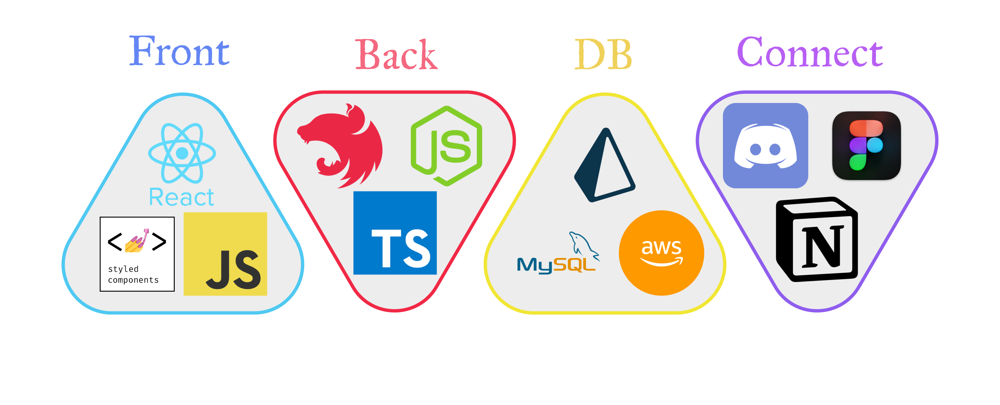
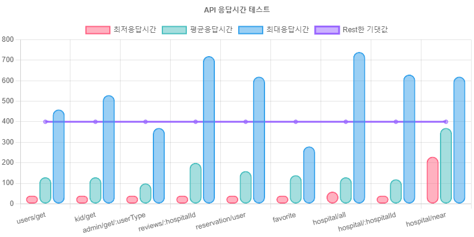
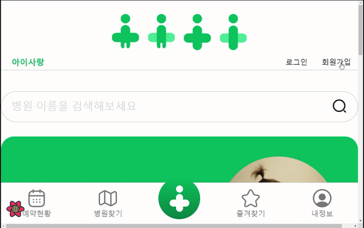
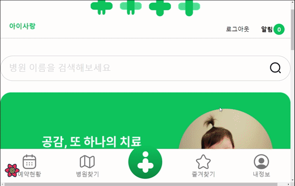
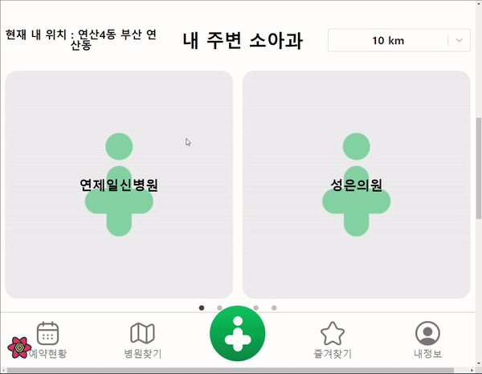
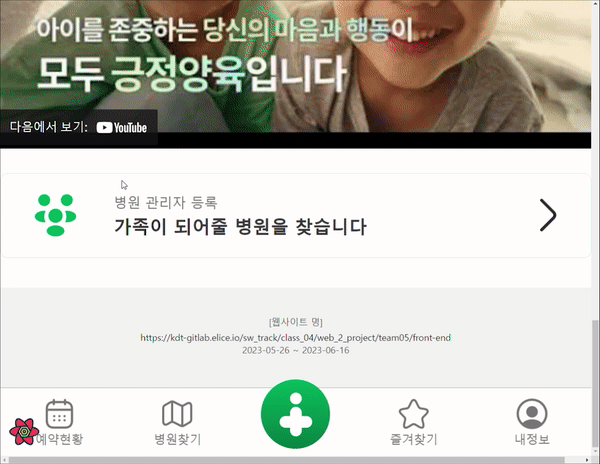
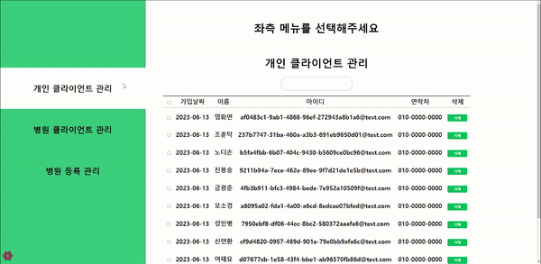

# SW4기 2차 5팀 프로젝트

**기획동기**

- 저출산 시대 줄어가는 신생아 수에 의해 빠르게 줄어가는 소아과를 언제 어디서나 바로 찾고 예약할 수 있는 서비스를 제공하자는 취지로 기획 하였습니다.

**서비스 이용대상**

- 자녀를 가진 부모님들
- 자녀가 없더라도 소아과 진료를 원하시는 분들

**서비스 목표**

- 위치 기준, 이름 기준, 언제 어디서든 가까운 소아과를 찾아줍니다.
- 자주 가는 소아과를 즐겨찾기를 할 수 있고, 다른 소아과라도 언제 방문했는지 예약내역을 확인할 수 있습니다.

**향후 기술 목표**

- 스마트폰 앱으로 서비스를 확대할 수 있게 스마트폰을 기준으로 프레임을 작성하였습니다.
- 알림창, 예방접종 등 더 다양한 서비스를 기획하고 있습니다.

# 전국에 등록된 모든 소아과를 찾아주고 이용할 수 있는 공공 이용 목적 웹 프로젝트 (아이사랑)

## 1. 서비스 소개

코로나 시대, 그리고 수 많은 전염병들에 걱정이 많은 시대.
우리 자녀가 혹시나 열이 나지는 않는지
두통이나 복통을 호소하지는 않는지

언제 어떻게 아플지 모를 아이를 위해서
전국의 모든 소아과를 여기에 담았습니다.

갑자기 우리 아이가 기침을 하며 고열을 호소할 때
가슴이 철렁 내려앉으실 부모님들께

조금이나마 저희가 빠르게 병원에 다다를 수 있게
해 드리고픈 마음 하나로 아이사랑을 제작하였습니다.

## 2. 서비스 기능 요약

**서비스**

- 가까운 위치별, 시군구 기준 키워드별 소아과를 진료하는 병원을 찾을 수 있습니다.
- 예약 및 달력을 이용해 언제 이용했고 예약했는지 내역을 확인할 수 있습니다.

**기능 소개**

- 여러가지 병원 검색 기능
- 예약 및 예약 내역 확인 기능
- 병원 관계자와 연동하여 등록된 병원 기준 병원 정보 최신화 기능

## 3. 서비스 구성

- 사용 기술 스택
  

- 와이어 프레임 : [와이어 프레임](https://www.figma.com/file/7l9vvHRjn6VYUsUlHOvmlC/%EC%95%84%EC%9D%B4%EC%82%AC%EB%9E%91-%EC%9B%B9%EC%82%AC%EC%9D%B4%ED%8A%B8?type=design&node-id=0-1&t=iQRbEkIpYiR0FXWO-0)

- API 명세서 : [API 명세서 SWAGGER](http://34.64.69.226:5000/docs) / ID: qhdtjq0427 / PW: 0427

- DB 모델링 : [관계도 및 스키마 명세서](https://www.notion.so/elice/640f9353a9bf4a9c85f7d0ed1417bb66)

## 4. 프로젝트 구성원 및 역할

|     이름     |             담당 업무             |      이름      |          담당 업무          |
| :----------: | :-------------------------------: | :------------: | :-------------------------: |
| 정민규(팀장) |    FE / 병원등록, 관리, 관리자    | 김봉섭(파트장) |       BE / 병원, 예약       |
|    김문진    | FE / 병원 상세 페이지·예약 페이지 |     노은탁     |       BE / 유저, 리뷰       |
|    박준형    |   FE / 마이 페이지, 자녀 페이지   |     이유진     |    FE / 예약 관련 페이지    |
|    이준미    |   FE / 메인홈, 로그인, 회원가입   |  이채연(1반)   | FE / 병원 검색, 지도 페이지 |

## 나의 활동 내역

김봉섭 : 백엔드 리더

- 기획 단계 : 백엔드 초기 개발 환경 구성, Auth API 및 데코레이터 구현, 프론트엔드, 백엔드 배포
- 개발 단계 : Hospital / Reservation / Favorite / image API 구현 및 Prisma, MySQL 환경 구성
- 담당 업무 : 병원, 병원 검색, 예약, 즐겨찾기 관리와 관련 된 모든 API 동작 구현 및 연동 확인 후 추가 API 최적화 테스트 및 발표진행

[트러블 슈팅]
1. API 속도 개선
 - API 성능 테스트를 위해 siege와 prisma middleware logging을 이용해 시간 측정.
 -  MySql의 ST_Distance_Sphere 함수를 이용해 실행 속도 0.4 sec -> 0.04 sec 단축.
 

2. 오픈 API 데이터 추출
 - fs/promises 를 이용해 실제 병원 데이터를 json 형태로 저장 후 DB로 마이그레이션.

3. 코드 유지보수 및 재사용성
 - 커스텀 데코레이터를 제작해 반복되는 코드 수 감소.
 - logger, interceptor, exception, prisma 미들웨어를 제작해 코드 재사용성 증가.
   

4. AWS Ubuntu 환경에서 DB 조작, 프론트 엔드, 백엔드 서버 배포

5. AWS S3 다중 이미지 업로드 기능 구현

## 5. 서비스 구현 영상 및 테스트 자료

각 API별 부하테스트

회원가입 및 로그인

내 정보 및 자녀 등록

병원 검색 및 예약

병원 관계자 및 관리자

